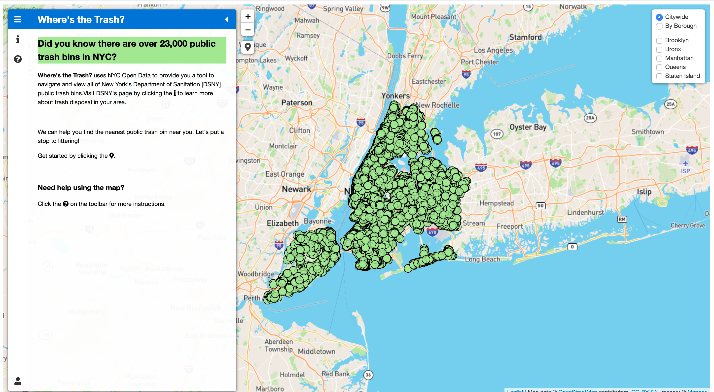

# Where's the Trash?
<!-- A one sentence description of the project or assignment -->
This is full-stack web development project where I create web server with Node.js and express, store information in a database using MongoDb Atlas, and create a front-end website with an interactive map. The map visualizes the New York Department of Sanitation's [DSNY] public trash bins across the 5 boroughs. 

<!-- It is good practice to add an about or summary -->
## About
This is a website that provides an interactive map for users to navigate and view all the DSNY public trash bins. Users can click and view the bins in two perspectives: Citywide and By Borough. In "Citywide" View, users can view all the data points on the map at the same time. In "By Borough", users can can click on the borough of their choice and only view points corresponding to the borough. Users can also find trash bins near them by clicking the geolocator icon on the map.

A detailed guide of the map's features is found on the website's help tab [here](https://wheresthetrash.herokuapp.com/).

<!-- Any knowledge or tools you will need before hand -->
### Prerequisites

1. A text editor or Integrated Development Environment (IDE)- preferably [VS Code](https://code.visualstudio.com/) to view code on your computer if you wish to download.

2. Node.js with NVM. To install on your computer, follow the instructions here [Node.js](https://github.com/itp-dwd/2020-spring/blob/master/guides/installing-nodejs.md)

<!-- any installation needs should be defined -->
<!-- Write instructions on how to start working on your project -->
<!-- Notes about the deployment -->
## Deployment

This project is hosted on Heroku. You can visit the rendered website [here](https://wheresthetrash.herokuapp.com/)

### Built with

* [VS Code](https://code.visualstudio.com/)
* [Github](https://github.com)
* [Heroku](https://www.heroku.com/)
* [Node.js](https://nodejs.org/en/)
* [MongoDB](https://www.mongodb.com/cloud/atlas)
* [Postman](https://www.postman.com/)
* [NYC Open Data](https://opendata.cityofnewyork.us/)
* [Leaflet](https://leafletjs.com/)
* [FontAwesome](https://fontawesome.com/)

### Process

1. I installed npm on my computer.

2. I created a folder to store all my webserver files and created a web server using Node.js that has dependencies on express, mongoose, and dotenv libraries.

3. Next, I created a database on mongodb and linked it to my server. I designed my data schema and loaded the [DSNY Public Litter Bins GEOJSON](https://data.cityofnewyork.us/dataset/DSNY-Litter-Basket-Inventory/uhim-nea2) data into my database, removing some attributes from the original file to lighten the load of data.

4. I set up my API endpoints and tested the HTTP requests locally using Postman to make sure my code was working properly. To read more about the specific API endpoints click [here](API.md)

5. After I finished my backend, I began thinking about the design of the website and drew a quick wireframe.

6. Next, I built my front-end website using html and css. I created the foundation for the map using [Leaflet](https://leafletjs.com/) and various Leaflet plugins by linking the libraries files in the index.html. 

7. I deployed the website on Heroku.

<!--For more details about the creative process of this website development, visit my [blog] (https://julielizardo.com/)-->
## Questions
* How can I make multiple data Schema in mongoDB and nest them into one another?
* How do I address multiple collections in my database?
* Can I link a js file located in node_modules in my index.html?

## Future Work
I would like to continue working on this project to add aditonally functionality and distance analysis. I also would like to build a sister site that visualizes public recycling bin data.

## License
Please reach out if you would like to fork this project or contribute to development

## Author

* [Julie Lizardo](https://www.linkedin.com/in/julie-lizardo/)  -- [Creative Engineer](https://julielizardo.com/)

<!-- thank and reference all the things that made your project happen -->
## References
* [DSNY Public Litter Bins GEOJSON](https://data.cityofnewyork.us/dataset/DSNY-Litter-Basket-Inventory/uhim-nea2) for the geojson file that contains all of the points of the New York Department of Sanitation's public trash bins
* [Borough Boundaries](https://data.cityofnewyork.us/City-Government/Borough-Boundaries/tqmj-j8zm) for the geojson file that contains all the points of the 5 bouroughs of NY
* [Leaflet Sidebar Plugin](https://github.com/noerw/leaflet-sidebar-v2) for the library to create side panel on map
* [Leaflet Spin Plugin](https://github.com/makinacorpus/Leaflet.Spin) for the library to create loading gif on map
* [Leaflet Locate Plugin](https://github.com/domoritz/leaflet-locatecontrol) for the library to create geolocation button and marker